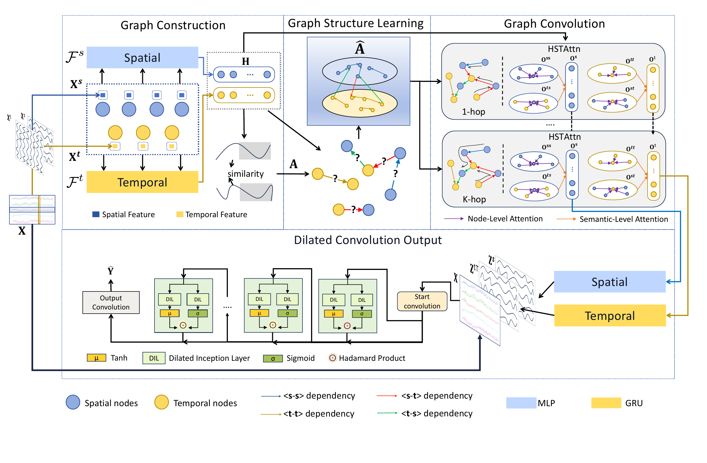

# 1 Heterogeneous Spatial Temporal Graph Neural Network

This is the offcial repository of paper "Heterogeneous Spatial Temporal Graph Neural Netork For Multivariate Time Series Forecasting"




# 2 Prepare Datasets

## single-step


ETTh1, ETTh2, ETTm1, ETTm2, ExchangeRate, ILI, Weather, Electricity will be downloaded automatically

for SP500 dataset, download from https://archive.ics.uci.edu/dataset/554/cnnpred+cnn+based+stock+market+prediction+using+a+diverse+set+of+variables, and put into ./data/SP500 as ./data/SP500/sp500.csv file

## multi-step

PEMS04, PEMS07 datasets are collected from https://github.com/Davidham3/STSGCN

PEMS-BAY, METR-LA datasets are collected from https://github.com/liyaguang/DCRNN

# 3 Run baseline&HSTGNN

## 3.1 install requirements

1. to run our code, **Please make sure your python version is >=3.8.**
2. install all the requirements, we assume that you have installed torch and pyg according to your environment
```
pip install -r ./requirements.txt
```


## 3.2 run scripts


Please first source this init.sh script:

```
source ./init.sh 
```

or manually add this directory to your PATHONPATH environment variable

```
export PYTHONPATH=./
```

### 1. single-step experiment

Please change the settings in the following for what you need.

```python
# running HSTGNN with length 3,6,12 on dataset ETTm1, ETTm2
./scripts/single_step.sh "3 6 12" "ETTm1 ETTm2"  "cuda:2" HSTGNN

# running Crossformer with length 3,6,12 on dataset ETTm1, ETTm2
./scripts/single_step.sh "3 6 12" "ETTm1 ETTm2"  "cuda:2" Crossformer
```
### 2. multi-step experiment


Please change the settings in the following for what you need.
```python
# running HSTGNN with length 3,6,12 on dataset METR_LA, PEMS04
./scripts/multi_step.sh "3 6 12" "METR_LA PEMS04" "cuda:0" HSTGNN

# running ESG with length 3,6,12 on dataset METR_LA, PEMS04
./scripts/multi_step.sh "3 6 12" "METR_LA PEMS04" "cuda:0" ESG
```


### 3. long-term multi-step experiment

```python
# running HSTGNN with length 96 168 336 720 on dataset ETTm1, ETTm2
./scripts/long_term_multistep.sh "96 168 336 720" "ETTm1 ETTm2"  "cuda:2" HSTGNN

# running Crossformer with length 96 168 336 720 on dataset ETTm1, ETTm2
./scripts/long_term_multistep.sh "96 168 336 720" "ETTm1 ETTm2"  "cuda:2" Crossformer
```


